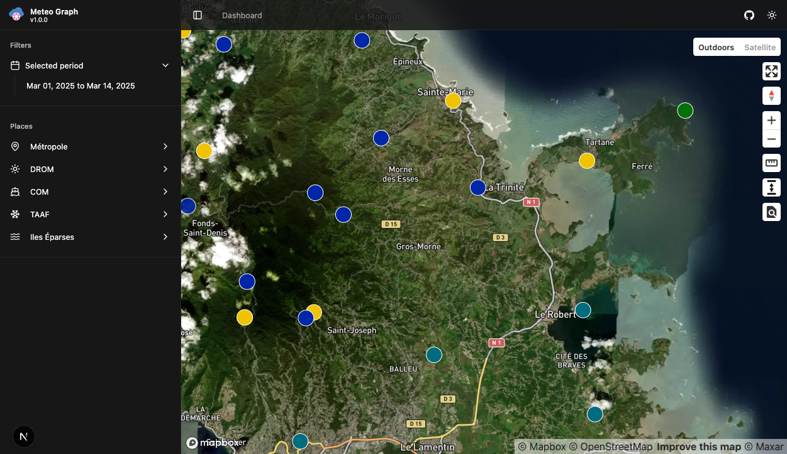
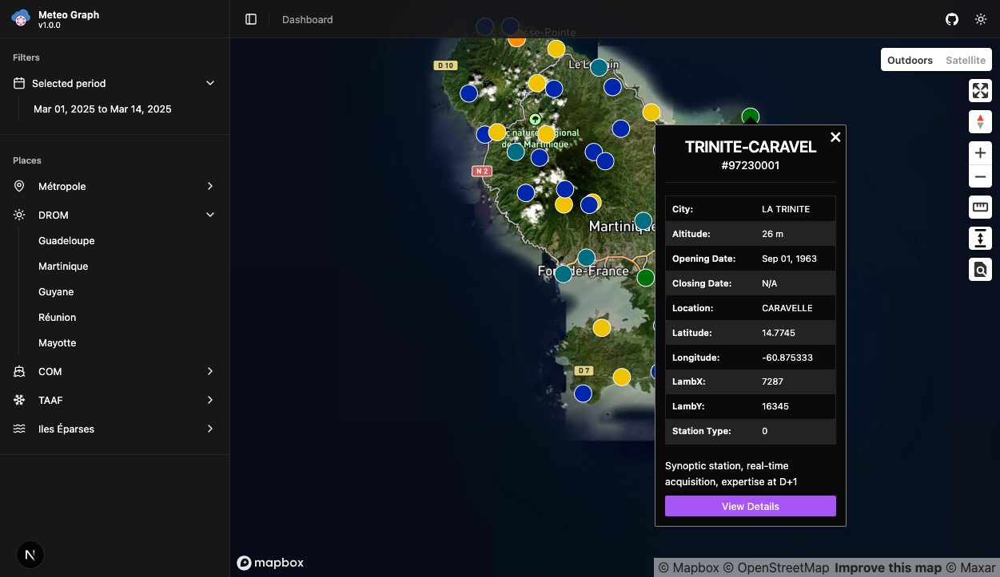
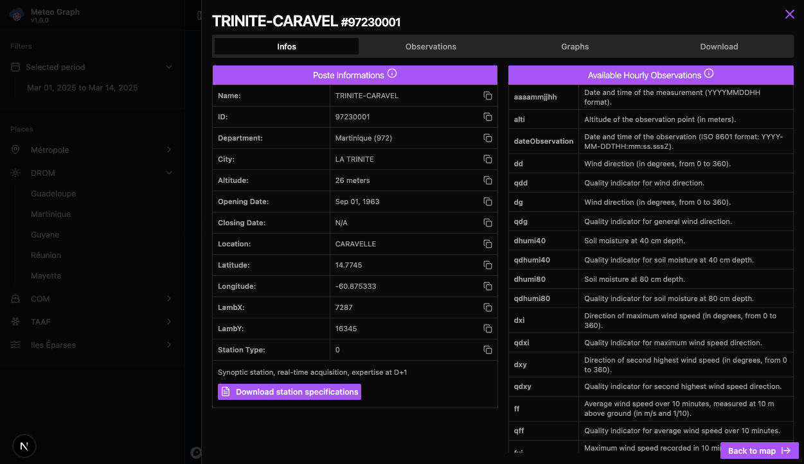
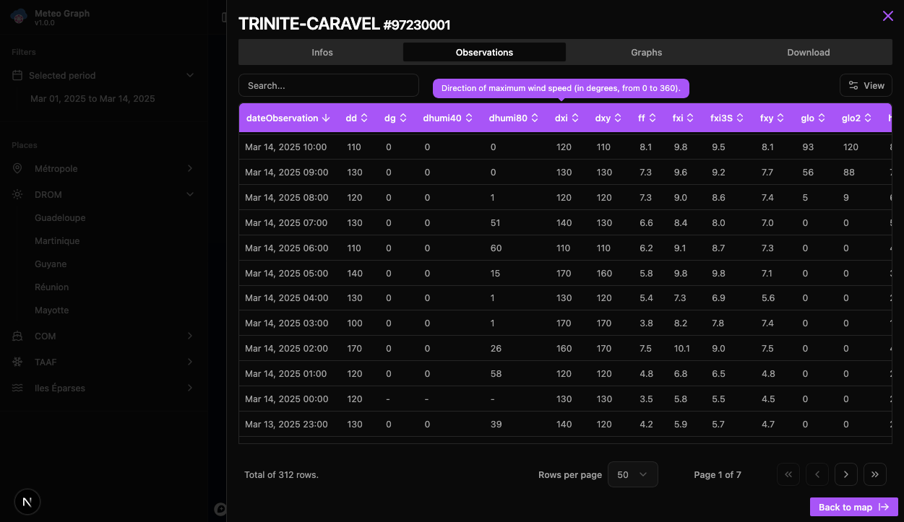
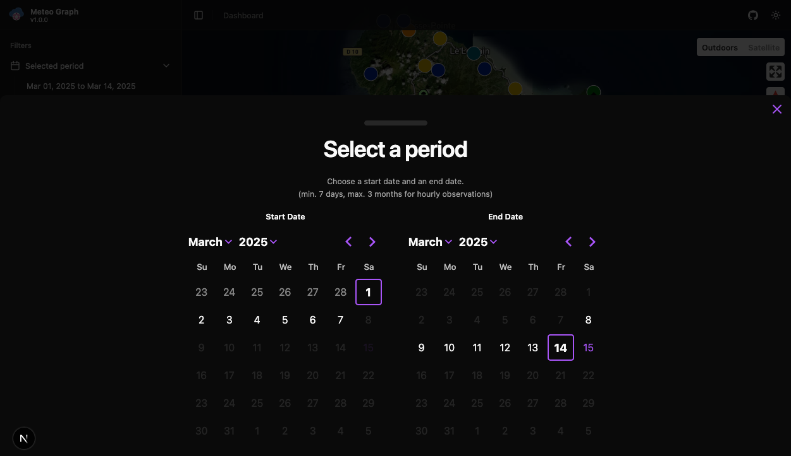

# Meteo Graph

Meteo Graph is a web application designed to provide structured and detailed weather observations based on historical
data from Météo-France. It enables users to explore past weather conditions with advanced filtering and visualization
tools.

[](./public/app/demo/Meteo-Graph-Historical-Weather-Observations5.png)
[](./public/app/demo/Meteo-Graph-Historical-Weather-Observations3.png)
[](./public/app/demo/Meteo-Graph-Historical-Weather-Observations4.png)
[](./public/app/demo/Meteo-Graph-Historical-Weather-Observations1.png)
[](./public/app/demo/Meteo-Graph-Historical-Weather-Observations0.png)

## Installation

### Prerequisites

- Node.js (>=16.x)
- Yarn or npm

### Steps

1. Clone the repository:
   ```bash
   git clone https://github.com/gilles-mastropasqua/meteo-graph-app.git
   cd meteo-graph
   ```
2. Install dependencies:
   ```bash
   npm install
   ```
3. Set up environment variables:
   ```bash
   cp .env.example .env
   ```
   Update `.env` with your database and API keys.
4. Run the development server:
   ```bash
   npm run dev
   ```
5. Open [http://localhost:3000](http://localhost:3000) in your browser.

## API Documentation

The Meteo Graph API provides access to historical weather data. To use the API, visit:
[https://api.meteo-graph.fr](https://api.meteo-graph.fr)

### Example Query (GraphQL)

```graphql
query {
    findUniquePoste(where: {numPoste: "10099002"}) {
        numPoste
        nomUsuel
        posteOuvert
        observations(
            take: 30
            orderBy: {dateObservation: desc}
            where: {dateObservation: {gte: "2025-02-24T22:00:00.000Z", lte: "2025-02-25T22:00:00.000Z"}}
        ) {
            numPoste
            dateObservation
            alti
            t
        }
    }
}
```

## License

For details, see the LICENSE file.

## Contact

For questions or contributions, please reach out at gilles.mastropasqua@gmail.com or open an issue on GitHub.
